[TOC]

## GPU Instancing+多层偏移，渲染基于模型的体积云

### 基本思路：对mesh的顶点进行多层偏移，采样3D Perlin Noise

多层偏移：突出体积感

采样3D Perlin Noise：突出云朵的絮状质感

https://flafla2.github.io/2014/08/09/perlinnoise.html


### 表现层面的思考

#### 3D Noise 和 2DNoise的区别，可以用2D Noise采样解决问题吗？

基于顶点坐标采样3D Noise，体积感本身就更强。

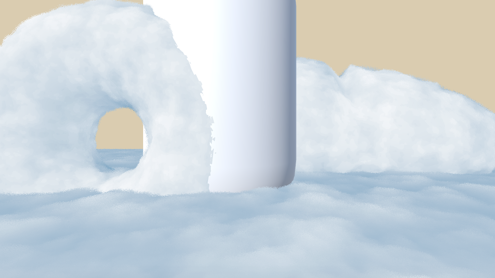

而基于2D的UV坐标采样的2D Noise，再使用UV动画，流动始终沿着模型表面，有点像龙卷风。

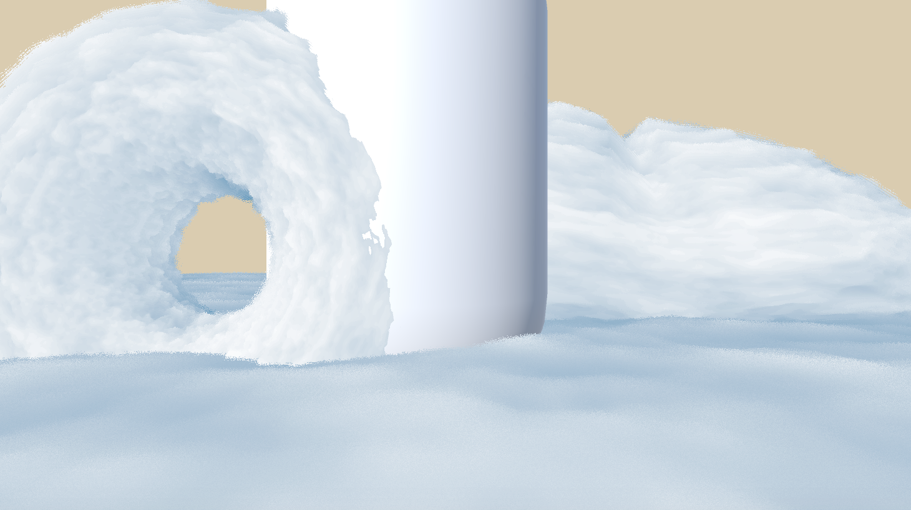

如何在采样2D Noise时，使得流动的层次感更加丰富？


#### 多层偏移，相比于视差贴图、RayMarching实现体积感的好处

相比于视差贴图的好处：基于模型，但又不会有特别强的棱角。

相比于RayMarching的好处：基于模型，移动端可用（？）。


#### 在多层偏移的实现中，如何避免边缘处分层过于明显

需要使用alpha dithering技术。dithering的合理实现方式是什么？


#### 在光影层面突出体积感的基本思路：基于当前层数，对光影进行调节。如何调节？

直接进行diffuse wraping，会导致背光区域也有过强的光影变化。

```
fixed diffuseTerm = pow((nl + 0.1) / 1.1, 1.2 - max(clipThres, noise));
```

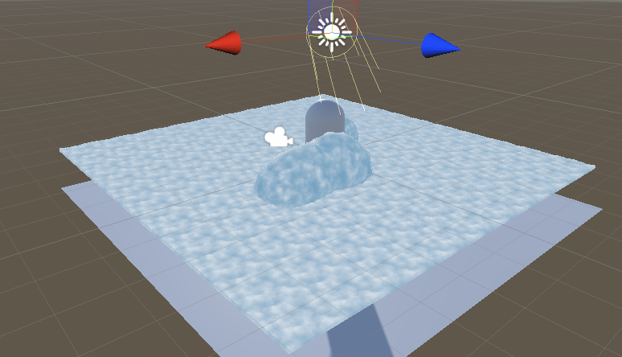


### GPU Instancing+多层偏移的实现

以下几种方案的效率依次提升。

##### 方法1：脚本生成多个不同的prefabs，每个prefabs单独设置MaterialPropertyBlock

##### 方法2：多次调用DrawMesh，每次传入不同的MaterialPropertyBlock

##### 方法3：使用DrawMeshInstanced+MaterialPropertyBlock(Array)，为每个Mesh设置不同的材质


此外，多pass的渲染办法可以控制绘制的顺序，但无法instancing。


### 调试问题1：云朵不接收阴影

#### 问题1：云朵不接收阴影

#### A. 问题描述

在Unity Editor中调试，当Target Platform是PC或ios时，都发现云朵不接收其他物体的阴影。

#### B. 分析思路

首先，要明确不同的platform上，一个gameobject要接收阴影需要满足哪些条件。以下参考https://github.com/candycat1992/Unity_Shaders_Book/issues/49的总结。

##### target platform = PC

在target platform = PC时，使用了SS Shadow Mapping。此时，一个gameObject既要有支持接收阴影的shader，又必须要渲染到depth texture中，才能接收阴影。具体而言，需要满足以下四个条件：

（1）"Queue" <=2500，且（2）有shadowcaster的pass，确保该像素会渲染到depth texture中

（3）开启receive shadows

（4）在正常光照的pass中使用接收阴影三剑客


##### target platform = iOS

在target platform = iOS时，使用传统的Shadow Mapping。此时，一个gameObject需要满足以下条件，方可接收阴影：（1）开启receive shadows，（2）在正常光照的pass中使用接收阴影三剑客。(3) "Queue" <= 2500

To cast/receive shadows, custom Shaders must be pixel-lit and use the **Geometry render queue**.


##### 接收阴影三剑客

###### 阴影相关宏定义

1. 在顶点着色器的输出结构体v2f中添加了一个内置宏SHADOW_COORDS(n) , n表示使用的TEXCOORD编号
2. 在顶点着色器返回之前添加另一个内置宏TRANSFER_SHADOW(o)
3. 在片元着色器中计算阴影值，这同样使用了一个内置宏SHADOW_ ATTENUATION(i)

###### 以上阴影相关宏，对变量名有额外要求

- a2v结构体中的顶点坐标变量名必须是vertex 
- 顶点着色器的输入结构体app_data必须命名为v 
- 且v2f中的顶点位置变量必须命名为pos


#### C. 调试过程

##### DrawMesh（或DrawMeshInstanced）的castShadows/receiveShadows参数

DrawMesh与DrawMeshInstanced函数，都专门有castShadows和receiveShadows的输入参数，等价于Mesh Render上的选项。https://docs.unity3d.com/ScriptReference/Graphics.DrawMesh.html


##### target platform = PC时的调试

在target platform = PC时，依次Debug，排查问题，四项条件都满足，但就是不接收阴影。

最后发现，由于要接受阴影，本身要明确光源。因此，在forward rendering中，需要通过Tags和预编译指令，明确要处理的光源。

对于Base Pass：

```
Tags {"LightMode"="ForwardBase"}
#pragma multi_compile_fwdbase
```

对于Additional Pass，默认不接收阴影，需要时需要如下开启：

```
Tags {"LightMode"="ForwardAdd"}
#pragma multi_compile_fwdadd
#pragma multi_compile_fwdadd_fullshadows
```

加上以上预编译指令后，可以得到如下结果（云朵不投射阴影，只接收阴影）：

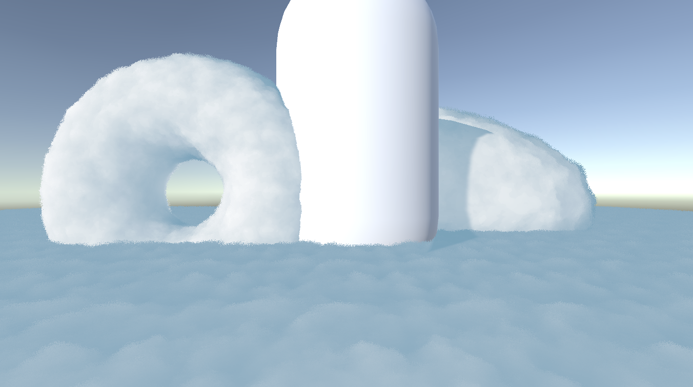

可以发现一个严重问题：阴影的范围并不对。这要追溯要SS Shadow Mapping（SSSM）的原理。SSSM依赖shadow caster pass渲染屏幕的depth texture，再计算阴影。因此接收阴影的计算，依赖于shadow caster pass。

而云朵默认的ShadowCaster pass由`FallBack "Diffuse"`所指定，这个pass使用的模型是无顶点偏移的模型。因此，只有原模型光栅化后对应的像素，才接受了阴影。

要解决这个问题，需要专门写一个顶点偏移后的ShadowCaster pass。


##### target platform = iOS时的调试

ios平台使用传统Shadow Mapping，不存在上面的问题。但因为缺少Shadow Cascades，所以阴影的锯齿比较明显。

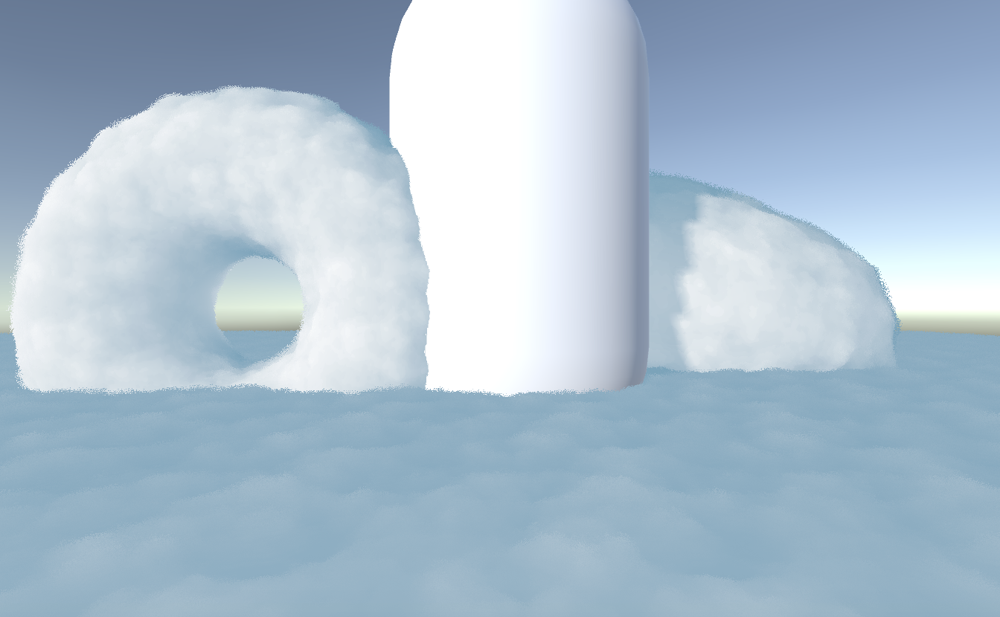


#### D. 总结

在前向渲染中，对于给定的gameObject，要想正确接收阴影，需要预编译指令来指定光源。因此，类似`#pragma multi_compile_fwdbase`的预编译指令是必不可少的。

此外，如果正常光照的pass中，模型发生了顶点偏移。如果使用SS Shadow Mapping，还需要覆写shadow caster的pass，使得接收阴影的模型区域正确。


#### E. 拓展：Unity提供的阴影Debug指南

https://docs.unity3d.com/Manual/ShadowPerformance.html

- Real-time shadows can be disabled completely in the Quality window. Make sure that you have the correct quality level enabled and that shadows are switched on for that setting.
- All Mesh Renderers in the scene must be set up with their *Receive Shadows* and *Cast Shadows* correctly set. Both are enabled by default but check that they haven’t been disabled unintentionally.
- Only opaque objects cast and receive shadows so objects using the built-in Transparent or Particle shaders will neither cast nor receive. Generally, you can use the Transparent Cutout shaders instead for objects with “gaps” such as fences, vegetation, etc. **Custom Shaders must be pixel-lit and use the Geometry render queue**.
- Objects using VertexLit shaders can’t receive shadows but they can cast them.
- In the Built-in Render Pipelne, using the Forward rendering path, some shaders allow only the brightest directional light to cast shadows (in particular, this happens with Unity’s legacy built-in shaders from 4.x versions). If you want to have more than one shadow-casting light then you should use the Deferred Shading Path instead. You can enabled your own shaders to support “full shadows” by using the `fullforwardshadows` surface shader directive.


### 问题2：尝试使用DrawMeshInstanced实现

#### 如何为每个instance传递不同的shader数据

参考https://forum.unity.com/threads/drawmeshinstanced-option-to-provide-per-instance-material-property-block.435716/

在MPB中，直接SetFloatArray，而shader不用改（shader还是用宏来定义的Props）。因为本质上，gpu instancing中的per-instance data，是在CPU阶段整理成数组，再传入GPU。因此，shader不变化时，使用SetFloatArray，就可以很方便地进行索引。

Using arrays in the single MaterialPropertyBlock is the preferred way to pass per-instance data to DrawMeshInstanced. In places where each renderer has a MaterialPropertyBlock (DrawMesh, or just regular MeshRenderers being batched) the internal instancing code goes through a loop to collect all data into one single MaterialPropertyBlock, and that is slower than doing that explicitly in scripting.


#### [待研究]如何为每个instance传递不同的数组数据

参考https://forum.unity.com/threads/pass-an-array-to-shader-using-gpu-instancing.607138/

如果要为每个instance传递不同的数组数据，比如每个instance都有不同的float array[8]，gpu instancing本身是不支持的。但可以变个办法，使用MPB.SetFloatArray传入长为8 * instance_num的数组，然后在索引时将ID乘8。即如下实现：

MPB.SetFloatArray("_Data", array);

UNITY_SETUP_INSTANCE_ID(i);

UNITY_ACCESS_INSTANCED_PROP(Props, _Data);

问题：如何将ID*8？？？


#### [待研究]Unity Draw Mesh Instanced如何调节绘制顺序做Alpha Blend

无法通过改变Queue，因为这样会破坏instancing。

有其他办法吗？https://forum.unity.com/threads/per-object-render-queue-in-instanced-rendering.639262/


### 问题3：半透明的实现方案

哪些地方需要半透明？

1. 根据noise和dithering，进行clip，丢弃面元，凸显层次感。

2. 与物体交叠的边缘，需要半透明，产生云里雾里的效果。

#### 方案1：Alpha Blend（ZWrite Off）

多片云同时存在时，绘制顺序不同，就会产生错误的透明效果，如下图：

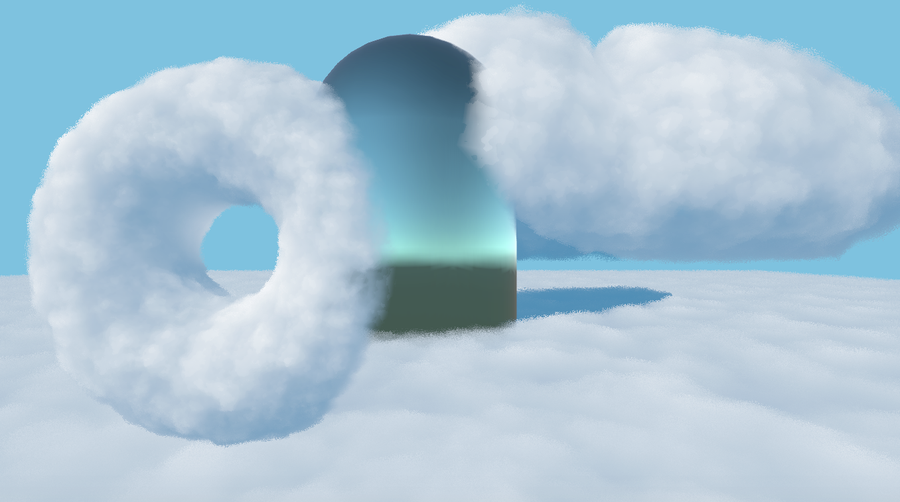

#### 方案2：Alpha Test （ZWrite On）

云朵的边缘，以及和物体交叠的边界，会显得生硬，如下图：

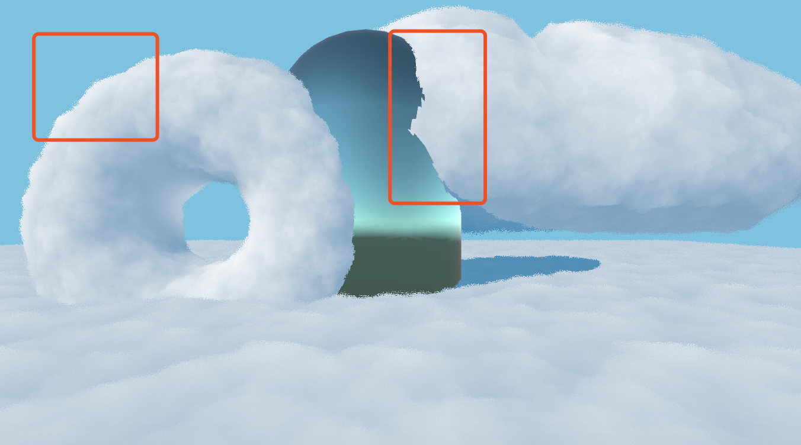

#### 方案3：Alpha Test + Alpha Blend（ZWrite On）

##### 具体方案：

1. 开启深度写入ZWrite On，使用Alpha Test丢弃部分片元
2. 对于未丢弃的fragment，进行透明度混合
3. 此外，为了使云朵与物体交叠的边界能柔和过渡，在云朵渲染前保存除云朵以外物体的Screen Space深度图（实际上，如果其他物体都为Opaque，可以从_CameraDepthNormalsTexture中直接获取），根据云朵与场景中的其他物体的Screen Space深度差，进行透明度混合。

##### 问题：云朵交汇边界处，透明度过高（而理想表现应该是近的面片罩住远的面片）

由于开启了ZWrite On，但是仍对片元进行了透明度混合，就会导致后面的云朵可能无法正常渲染。

原因：如果离相机近的云朵先渲染，就会更新ZBuffer，同时进行透明度混合。接下来，再渲染离相机远的云朵时，部分片元就无法通过ZTest，而这些片元对应的像素，可能还是背景的颜色（因为先渲染的云朵在此处透明度过高）。从而导致交汇边界处错误地“透出”背景的颜色。

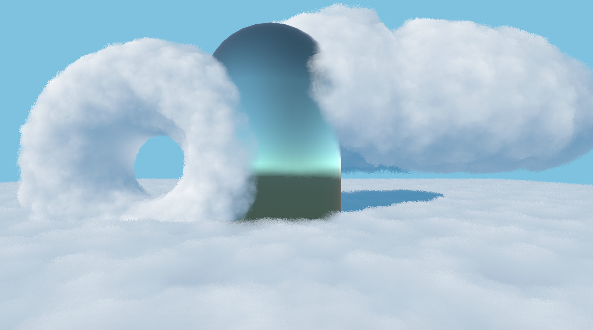

##### 可能的改进方向：云朵较少的时候，CPU进行物体排序，调节渲染队列

但会比较耗性能，同时破坏相同模型云朵之间的gpu instancing。

好在本身用的就是gpu instancing，每朵云绘制的多层仍然能进行合批。

如果采用CPU更改渲染队列的方案，模型相同的不同云朵之间就不能合批。

#### 方案4：其他物体先渲染 + Alpha Test渲染云朵 + 边界处透明度混合

需要技术：

1. 渲染目标重定向
2. 在合适的渲染阶段（使用Command Buffer），从ZBuffer中拷贝深度纹理
3. 后处理，基于深度差进行混合

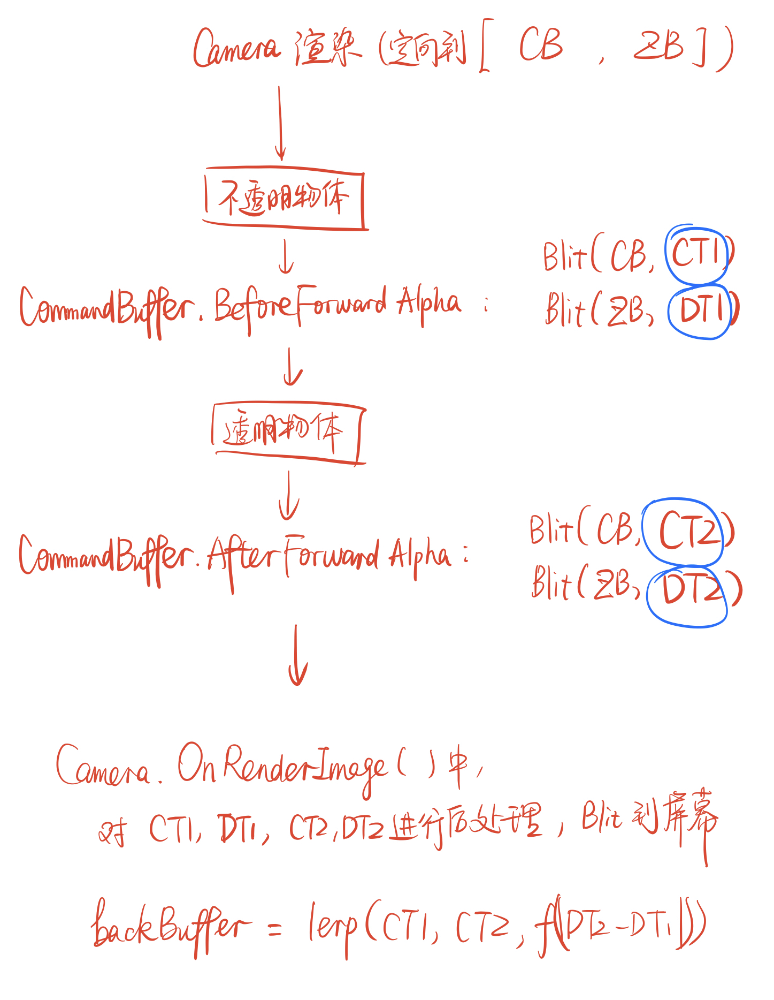

##### 改进空间：使用MRT技术，将云朵边缘信息写入一张纹理，用于blend时调节边缘透明度。

#### 方案5：从美术角度，遮盖瑕疵

是否可用雾效，来遮盖方案3交汇边界透明的瑕疵？


### 最终效果呈现

待完成：云海建模


## Unity Built-In渲染管线的执行顺序及其拓展

### 渲染管线

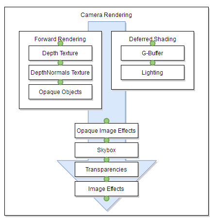


### 渲染有关事件函数执行顺序

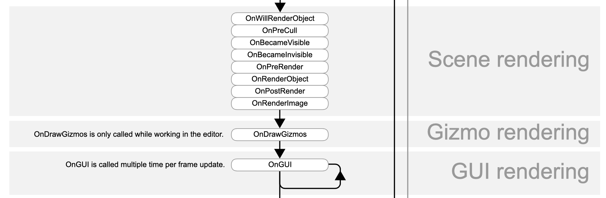

其中，有些函数必须绑定在相机上，有些则绑定在游戏物体上：

| 绑定在相机上                         | 绑定在游戏物体上                      |
| ------------------------------------ | ------------------------------------- |
| **OnPreCull**                        | **OnWillRenderObject**                |
| **OnPreRender**                      | **OnBecameVisible/OnBecameInvisible** |
| **OnPostRender**                     | **OnRenderObject**                    |
| **[ImageEffectOpaque]OnRenderImage** | **OnGUI**                             |
| **OnRenderImage**                    | **OnDrawGizmos**                      |


### Command Buffer及可拓展节点


### 后处理（屏幕空间处理）

#### 屏幕后处理常用函数

https://blog.csdn.net/gy373499700/article/details/72958453

#### Graphics有关函数，关于坑说的比较透彻

https://www.cnblogs.com/Tearix/p/7803320.html

https://blog.csdn.net/wodownload2/article/details/104424005

#### 后处理中的平台差异性问题

后处理中的平台差异性问题https://zhuanlan.zhihu.com/p/29228304


### 着色器替换技术【待实践】

待实践https://www.jianshu.com/p/4e8162ed0c8d


### MRT（Multiple Render Targets）技术【待研究】


## 屏幕信息(颜色/深度)的获取、存储、及其传入着色器

很多复杂的效果，都依赖于屏幕信息(或某一摄像机渲染信息)的获取。有时需要获取的是屏幕的颜色信息（即$\text{Color_Buffer}$），有时则需要获取深度信息（即$\text{Z_Buffer}$）。此外，获取以上信息的时机也可能不同，即在渲染管线的不同阶段获取。

为了在面对不同需求时，能找到合适的技术路线，我们就需要明确计算机中屏幕信息的存储形式（FBO, 2D纹理、渲染纹理），以及对这些对象进行保存或后续传递的方法。

### 1. 纹理在计算机中的存储形式

#### 1.1 CPU与GPU上纹理的存储形式

CPU: texture2D，即2D纹理。

GPU: FrameBufferObject，即帧缓冲对象，可保存有colorBuffer，depthBuffer，stencilBuffer等。

Unity中的RenderTexture其实是FrameBufferObject的实现。RenderTexture并不将纹理信息保存在CPU中，而是链接到GPU的一个FrameBufferObject 。

#### 1.2 屏幕信息在计算机中的保存/访问方式

屏幕信息本质上是存储在FBO中。基于以上存储形式，我们有以下几种不同的屏幕信息保存方式：

1. 从FBO中读取屏幕信息，复制到CPU（使用tex2D.readPixels()）
2. 在GPU对FBO进行一份拷贝（使用Graphics.Blit()）
3. 直接使用RT链接到FBO，直接访问使用，无需拷贝


### 2. Unity中RenderTexture的原理

#### 2.1 FBO与RenderTexture的底层原理

关于RenderTexture的原理https://blog.csdn.net/leonwei/article/details/54972653

#### 2.2 GrabPass

GrabPass获取屏幕图像https://zhuanlan.zhihu.com/p/29378964

##### GrabPass的底层原理是什么？据说是RenderTexture

GrabPass的底层原理是：GPU把一整个帧从back-buffer（默认framebuffer）拷贝到一个渲染纹理里，然后可以在shader中采样这个渲染纹理，shader的计算结果则输出回到back-buffer。这个过程看起来人畜无害，除了拷贝这一步。拷贝一整帧对性能伤害很大，尤其是对移动平台来说。所以如果一定要grab pass，最好是只grab一次。为了确保只拷贝一次，像下面这么写，然后再其他所有地方用_GrabTexture这同一个名字。

```glsl
GrabPass{ "_GrabTexture" }
```

来自https://zhuanlan.zhihu.com/p/124961603，制作能量罩+冲击波吸收特效


### 3. RenderTexture的创建与释放

#### 3.1 常驻RenderTexture的使用

适用于需要长期保存，用于后续访问的情况。

##### 3.1.1 new构造仅是指定参数，首次使用或调用Create()时才分配FBO

```C#
//调用构造函数并未立即在GPU上分配FBO，在第一次使用时、或者手动调用Create()函数时，才链接到GPU上的FBO
RenderTexture rt = new RenderTexture(var inputs);
//调用Create()函数时，rt会链接到GPU上的FBO。如已链接，则不进行任何操作
rt.Create();
//确保不再使用后，务必Release释放空间
rt.Release();
```


##### 3.1.2 释放Release()

###### 待研究：`DestroyImmediately(rt)`和`rt.Release()`哪种释放方式对？

RT的释放：https://zhuanlan.zhihu.com/p/41251356


##### 3.1.3 需要在后面的帧不得不restore一个RT时，使用MarkRestoreExpected()

```
rt.MarkRestoreExpected();
```

Indicate that there's a RenderTexture restore operation expected.

When in mobile graphics emulation mode, Unity issues warnings when a RenderTexture "restore" operation is performed. Restore happens when rendering into a texture, without clearing or discarding ([DiscardContents](https://docs.unity3d.com/ScriptReference/RenderTexture.DiscardContents.html)) it first. This is a costly operation on many mobile GPUs and multi-GPU systems and best should be avoided.

However, if your rendering effect absolutely needs a RenderTexture restore, you can call this function to indicate that yes, a restore is expected, and Unity will not issue a warning here.


#### 3.2  用于临时存储与计算：GetTemporary()

适用于快速临时计算或中转站，比如多个Blit中的中间值。

##### 3.2.1 获取：GetTemporary()

Allocate a temporary render texture.

This function is optimized for when you need a quick RenderTexture to do some temporary calculations. Release it using [ReleaseTemporary](https://docs.unity3d.com/ScriptReference/RenderTexture.ReleaseTemporary.html) as soon as you're done with it, so another call can start reusing it if needed.

Internally Unity keeps a pool of temporary render textures, so a call to GetTemporary most often just returns an already created one (if the size and format matches). These temporary render textures are actually destroyed when they aren't used for a couple of frames.

If you are doing a series of post-processing "blits", it's best for performance to get and release a temporary render texture for each blit, instead of getting one or two render textures upfront and reusing them. This is mostly beneficial for mobile (tile-based) and multi-GPU systems: **GetTemporary will internally do a [DiscardContents](https://docs.unity3d.com/ScriptReference/RenderTexture.DiscardContents.html) call which helps to avoid costly restore operations on the previous render texture contents.**

You can not depend on any particular contents of the RenderTexture you get from GetTemporary function. It might be garbage, or it might be cleared to some color, depending on the platform.


##### 3.2.2 释放：ReleaseTemporary()

Release a temporary texture allocated with [GetTemporary](https://docs.unity3d.com/ScriptReference/RenderTexture.GetTemporary.html).

Later calls to [GetTemporary](https://docs.unity3d.com/ScriptReference/RenderTexture.GetTemporary.html) will reuse the RenderTexture created earlier if possible. When no one has requested the temporary RenderTexture for a few frames it will be destroyed.

```C#
//分配RT
RenderTexture rt = RenderTexture.GetTemporary();
...
//完成使用后，立即释放临时资源
RenderTexture.ReleaseTemporary(rt);
```


##### 3.2.3 丢弃：DiscardContents()

Hint the GPU driver that the contents of the RenderTexture will not be used.

On some platforms, it can be good for performance if you indicate when the current contents of a RenderTexture aren't needed any more. **This can save copying it from one kind of memory to another when the texture is reused.** Xbox 360, XBox One and many mobile GPUs benefit from this.

This call is typically only meaningful when the given RenderTexture is currently an active render target. After this call, the contents of the RenderTexture are undefined, so the user should not attempt to access its contents before either clearing the RenderTexture or drawing into each pixel of it.


https://forum.unity.com/threads/where-to-call-rendertexture-discardcontents.215555/

So what do DiscardContents do:

1. it marks appropriate render buffers (there are bools in there) to be forcibly cleared next time you activate the RenderTexture
2. IF you call it on active RT it will discard when you will set another RT as active.


##### 3.2.4 Best Practice: 用完就Release，再用再Get

###### 正确方案： 用完就Release，再用再Get

```C#
//make it possible to be reused in a later GetTemporary()
RenderTexture.ReleaseTemporary(buffer0);
//GetTemporary() calls DiscardContents() internally
buffer0 = RenderTexture.GetTemporary(rtW, rtH, 0);
```

###### 错误方案： 直接discardContents()，对性能影响很大！！！

```C#
buffer0.DiscardContents();
```

经测试，上述代码会在重用时，对buffer进行clear。对性能影响很大。


### 4. 渲染目标的定向

创建了RenderTexture，我们还需要自如地改变渲染的流向，才能获取渲染结果。

#### 4.1 Unity的渲染目标定向规则

关于FrameBuffer及定向规则https://blog.csdn.net/leonwei/article/details/73927878

#### 4.2 Unity中渲染目标定向的方式

##### 1. Camera层级重定向

```C#
Camera.targetTexture = rt;
Camera.SetTargetBuffers(colorBuffer, depthBuffer);
```

###### 在Camera渲染中间阶段（比如全部不透明物体渲染完后），也能重新定向！但要注意自己Clear

比如在如下函数中，能改变

```
[ImageEffectOpaque]
void OnRenderImage(src, dest);
```


##### 4.2.2 待研究：Graphics层级重定向

直接改变接下来Graphics操作，如Graphics.DrawMesh()等的流向。

注意，在改变定向后，不会自动复原。

```C#
//2.1 The following two lines are equivalent
RenderTexture.active = rt;
Graphics.SetRenderTarget(rt);
//2.2
Graphics.SetRenderTarget(colorBuffer, depthBuffer);
```

###### 待研究：是否会影响其他Camera渲染的流向？

测试不会，只会改变DrawMesh相关函数的流向。


##### 3. CommandBuffer层级

CommandBuffer进行重定向，仅会影响这个CommandBuffer中操作的流向，不影响后续渲染管线的流向。

```C#
//利用CommandBuffer进行重定向，仅会影响这个CommandBuffer中操作的流向
//CommandBuffer中的指令执行完毕后，流向会复原回原状态，不会影响后续正常渲染流向
CommandBuffer cb = new CommandBuffer();
cb.SetRenderTarget(rt);
cb.SetRenderTarget(colorBuffer, depthBuffer);
```


### 5. 将RenderTexture(GPU端)的颜色/深度保存到tex2D(CPU端)

#### 5.1 获取当前屏幕的backColorBuffer信息到texture2D

https://docs.unity3d.com/ScriptReference/Texture2D.ReadPixels.html


#### 5.2 保存任一张RenderTexture的ColorBuffer信息到texture2D

https://answers.unity.com/questions/27968/getpixels-of-rendertexture.html

```
//将myRenderTexture的ColorBuffer，保存到tex2D中
//上文已有：RenderTexture myRenderTexture;
//...

//1. 利用RenderTexture.active，设置当前活跃的RT
//注意：保存之前活跃的RT,便于操作完成后，恢复原状态
RenderTexture currentActiveRT = RenderTexture.active;
RenderTexture.active = myRenderTexture;

//2. 从当前活跃的RT（也即myRenderTexture）中，读取到tex2D
Texture2D tex2D = new Texture2D(width, height, TextureFormat.RGB24, false);
tex2D.ReadPixels(new Rect(0, 0, width, height), 0, 0);
tex2D.Apply();

//3. 恢复原状态
RenderTexture.active = currentActiveRT;
```


#### 5.3 将Zbuffer中的深度信息保存到tex2D

Zbuffer中的深度值并不能在CPU端直接获取，但可以先渲染到一张深度纹理，再像5.2一样处理。

所谓深度纹理，就是一张RGBA通道编码了深度值的RenderTexture。

##### 思路1：利用`Graphics.Blit()`将Zbuffer数据绘制到深度纹理depthTexture中

1. 利用`Camera.SetRenderTarget(colorBuffer, depthBuffer)`改变摄像机的渲染流向
2. 在合适时机，利用`Graphics.Blit(depthBuffer, depthTexture)`或`commandBuffer.Blit(depthBuffer, depthTexture)`，将深度ZBuffer数据，绘制到深度纹理depthTexture中。
3. 使用5.2的方式进行保存。


##### 思路2：利用MRT技术，在绘制场景时，直接把深度信息绘制到深度纹理depthTexture中

待实践MRT技术。


### 6. 将RenderTexture传入着色器

核心：在合适的时机，设置shader变量。

##### 疑问：RenderTexture作为shader的全局属性，与单个shader的局部属性，性能上有何区别？

1. `CommandBuffer.SetGlobalTexture("name", rt)`或`Shader.SetGlobalTexture("name", rt)`设置的是全局属性（global shader property），所有shader都可以读取。
2. 针对某个material来设置纹理，如`material.SetTexture("name", rt)`，设置的是局部属性，只有这个着色器可以访问。


### 7. 常见应用场景

具体而言，在游戏实时渲染中，屏幕图像的获取常用于以下场景：

1. 在一帧渲染完成后，获取当前屏幕（或某一摄像机）的颜色信息（$\text{Color_Buffer}$）。用于截图保存。此时可考虑将摄像机的RenderTexture保存到texture2D中。

2. 在一帧渲染的中间阶段，获取当前屏幕（或某一摄像机）渲染的颜色信息（$\text{Color_Buffer}$），用于后续物体的绘制（即作为纹理，传递到后续物体的着色器）。此时可考虑使用改变渲染流向到特定的RenderTexture（参见4.2），利用`Command Buffer`或特定的渲染事件函数，控制在特定时间点保存RenderTexture。此外，`GrabPass`也可以直接在shader中抓屏（方便但是分辨率不太可控，难以优化性能）。

3. 在一帧渲染的中间阶段，获取当前屏幕（或某一摄像机）渲染的深度信息（$\text{Z_Buffer}$），用于后续物体的绘制。例如，先渲染一部分物体${G_1}$，获得图像$T_{1} = (CB_{1}, ZB_{1})$；接下来渲染另一部分物体${G_2}$时，对每个片元根据深度差$|ZB_{1}-ZB_{2}|$进行alpha blend。这就需要将T1的深度纹理$ZB_{1}$，传递到$G_2$的着色器中。

4. 先渲染一部分物体${G_1}$，获得图像$T_{1} = (CB_{1}, ZB_{1})$；接下来渲染另一部分物体${G_2}$到另一个纹理，获得图像$T_{2} = (CB_{2}, ZB_{2})$时。接下来根据深度差$|ZB_{1}-ZB_{2}|$，对$CB_{1}$和$CB_2$进行alpha blend。注意3和4的区别在于，3的depthTexture是传入物体绘制的着色器，4则类似于后处理。

5. 单个物体Bloom+深度剔除https://zhuanlan.zhihu.com/p/55537649

   基本思路：对要bloom的物体，单独绘制后，和原场景融合。其中，使用了原场景的depthTex，对要发光的物体进行深度剔除。


### 8. 基于深度剔除/模板测试的后处理

#### 8.1 基于深度剔除的后处理

在变更绘制目标时，仍使用之前的depthBuffer，可以对后续绘制的物体进行深度剔除https://zhuanlan.zhihu.com/p/55537649。

```C#
camera.SetTargetBuffers(colorBuffer1, depthBuffer);
camera.DrawSomeMeshes();//先绘制一批物体，就会将颜色绘制到colorBuffer1中，深度写到depthBuffer中
camera.SetTargetBuffers(colorBuffer2, depthBuffer);
camera.DrawOtherMeshes();//再绘制物体到colorBuffer2，就会利用depthBuffer的已有内容进行深度剔除
```

#### 8.2 基于模板测试的后处理

Unity中的stencil buffer应该是绑定在depth buffer上的，因此只要depth buffer的格式支持stencil buffer，就可以用模板buffer的值来进行后处理。

##### 8.2.1 基于模板剔除，将单个物体绘制到纹理

http://qiankanglai.me/2015/03/07/unity-posteffect-stencil/index.html

```C#
camera.SetTargetBuffers(colorBuffer1, depthBuffer);
//先绘制一批物体，就会将颜色绘制到colorBuffer1中，深度和模板值写到depthBuffer中
camera.DrawSomeMeshes();

camera.SetTargetBuffers(colorBuffer2, depthBuffer);
camera.DrawOtherMeshes();//再绘制物体到colorBuffer2，就会利用depthBuffer的已有内容进行深度和模板剔除

//最后可以保证colorBuffer2中绘制的内容，已经经过了深度与模板剔除，可以进行后期融合了。
DoSomethingWith(colorBuffer1, colorBuffer2);
```

##### 8.2.2 在后处理中，再进行屏幕空间的模板测试

https://forum.unity.com/threads/has-anyone-ever-gotten-a-stencil-buffer-to-copy-with-commandbuffer-blit.432503

https://forum.unity.com/threads/commandbuffer-blit-with-no-custom-shader-commandbuffer-blit-with-internal_blitcopy-shader.432699/?_ga=2.155861107.974799359.1585815570-1528687288.1572745651#post-2798713


## 屏幕空间深度的计算与获取

### 1. 深度的多种表示，及其平台差异

 [深度及其平台差异.pdf](深度及其平台差异.pdf)


### 2. 自行在Shader中计算当前片元的深度

所谓深度，其实并没有一个严谨统一的定义。不同图形API，不同应用场景（线性/非线性）下，"深度"的取值都有不同。

为了下文行文统一，我们在此给出深度的定义。**某一片元的深度，是指该片元在特定的图形API下，写入到ZBuffer中的值，记为$d$。**这个深度值是非线性的，在不同平台上会不同。

但更多时候，我们需要的是和距离成正比的"深度"。因此，也有更多不同的深度表达方法，详见下文。

#### 2.1 不那么"精确"的深度

很多时候，面片在clip空间中的$Z_{\text{clip}}$坐标，就可以近似用作"深度" 了。这是因为，$Z_{\text{clip}}$本身就和面片距离摄像机的远近$Z_{\text{view}}$呈线性关系（当然，并不是正比，偏置量在不同平台上都有不同）。

要想在Fragment Shader中获取$Z_{\text{clip}}$，可以有以下途径：

1. 注意，不能直接使用SV_POSITION语义的输入！因为该语义对应的变量，在输入到fragment shader时，早已不再是vertex shader的输出值$P_{\text{clip}}$。具体而言，其xy分量，被转换成了屏幕空间的像素坐标。而zw分量具体存的是什么值，也没有特别明确的文档说明ε=(´ο｀*))。等待后期进一步研究。
2. 如果Vertex Shader中使用了`float4 scrPos = ComputeScreenPos(clipPos)`，那么传到Fragment Shader后，`scrPos`的各个分量如下：$$(\frac{x_c + w_c}{2}, \frac{y_c + w_c}{2}, z_c, w_c)$$。因此，使用`scrPos.z`就可以访问到$Z_{\text{clip}}$。


相比于$Z_{\text{clip}}$，其实$|Z_{\text{view}}|$是我们更方便理解和计算的线性"深度"，它就是摄像机距面片的绝对距离。可以很方便的在Vertex Shader中计算：

```glsl
#define COMPUTE_EYEDEPTH(o) o = -UnityObjectToViewPos( v.vertex ).z
```

如果对$|Z_{\text{view}}|$进行归一化，就是我们说的线性0-1深度，记为$Z_{01}=\frac{|Z_{\text{view}}|}{far}$. 它可以方便地作为颜色分量进行输出。

```glsl
#define COMPUTE_DEPTH_01 -(UnityObjectToViewPos( v.vertex ).z * _ProjectionParams.w)
```


#### 2.2 "精确"的深度计算

但是，在一些情况下，我们需要将当前面片的深度值，和Unity为我们提供的深度值（比如RenderTexture中$Z\text{Buffer}$的值，或屏幕空间深度纹理的采样值$d$）进行比较或求差值。这时，上述办法就不够用了。因为这些情况要求，我们计算深度的公式，要和Unity为我们提供的深度值的计算方式完全统一。为此，我们要明确$d$和$|Z_{\text{view}}|$，$Z_{01}$之间的关系。

##### 2.2.1 $d$的取值平台差异，及其与$|Z_{\text{view}}|$，$Z_{01}$的转换

为了在不同平台上，都能和Unity提供的深度值完全统一，我们在自行计算深度时，就需要处理以下两种情况：

（1）处理深度的跨平台差异。对于OpenGL，DX10及之前，DX11~12，深度值的取值都有所不同，因此：

|                     | near clip plane | far clip planec |
| ------------------- | --------------- | --------------- |
| OpenGL              | -1              | 1               |
| DX10                | 0               | 1               |
| DX11~12(Reversed Z) | 1               | 0               |

（2）明确是"哪个深度"。在同一平台上，通过不同的纹理采样及函数处理后，Unity为我们提供的"深度"可能会不同。具体而言，需要明确，这个"深度"，是非线性的$d$，还是线性的$|Z_{\text{view}}|$或$Z_{01}$。在Unity 2019.3.3f中，遵循以下规则：

- 将相机渲染结果定向到RenderTexture后，从其depthBuffer读取的深度值，是该平台上的$d$。
- 从`_CameraDepthTexture`（或`_LastCameraDepthTexture`）中采样的所得的深度值，也是该平台上的$d$。
- 从`_CameraDepthNormalsTexture`中采样，再用`DecodeFloatRG()`解码的所得的深度值，是$Z_{01}$。
- 将该平台上的$d$作为参数，通过`LinearEyeDepth(d)`计算所得的，是$|Z_{\text{view}}|$，与平台无关。
- 将该平台上的$d$作为参数，通过`Linear01Depth(d)`计算所得的，是$|Z_{\text{01}}|$，与平台无关。

###### 自行计算d：要处理平台差异

具体处理方式参考 [深度及其平台差异.pdf](深度及其平台差异.pdf)

###### 自行计算$|Z_{view}|$和$|Z_{01}|$

注意：如果先将clipPos转换为d后，再用LinearEyeDepth(d)或LinearEyeDepth(d)解码，就绕了很大的远路。而且对d的平台差异处理，还需要复杂的预编译指令。

方便的，正确的办法是，直接在Vertex Shader中计算$|Z_{view}|$和$|Z_{01}|$，这样都完全不用处理平台差异性。

##### 2.2.2 利用Unity提供的宏，直接处理平台差异

https://docs.unity3d.com/Manual/SL-DepthTextures.html

```GLSL
//在UnityCG.cginc中

#define COMPUTE_EYEDEPTH(o) o = -UnityObjectToViewPos( v.vertex ).z
#define COMPUTE_DEPTH_01 -(UnityObjectToViewPos( v.vertex ).z * _ProjectionParams.w)

#define DECODE_EYEDEPTH(i) LinearEyeDepth(i)
// Z buffer to linear depth
inline float LinearEyeDepth( float z )
{
    return 1.0 / (_ZBufferParams.z * z + _ZBufferParams.w);
}
// Z buffer to linear 0..1 depth
inline float Linear01Depth( float z )
{
    return 1.0 / (_ZBufferParams.x * z + _ZBufferParams.y);
}

```

###### 在Vertex Shader中计算线性深度

- **COMPUTE_EYEDEPTH(i)**: computes eye space depth of the vertex and outputs it in **o**. Use it in a vertex program when **not** rendering into a depth texture.
- **COMPUTE_DEPTH_01**:  returns the 0-1 linear depth of the vertex. Use it in a vertex program when **not** rendering into a depth texture.

###### 在Fragment Shader中，从深度纹理中解码线性深度

- **DECODE_EYEDEPTH(i)/LinearEyeDepth(i)**: given high precision value from depth texture **i**, returns corresponding eye space depth.
- **Linear01Depth(i)**: given high precision value from depth texture **i**, returns corresponding linear depth in range between 0 and 1.

注意，由于自己写的shader中的其他计算结果，有可能本身就是以上宏的中间计算结果。这种情况下，直接调用宏来计算，就可能带来重复计算（虽然影响甚微）。所以，如果要优化性能，可以自己自行计算。


#### 2.3 自行计算深度的常见应用场景

在fragment shader中自行计算深度，一般有以下两个用途

- 有针对性地选取物体加入基于深度(差)的特效
- 使用shader replacement技术，结合摄像机的culling mask，绘制自定义的深度纹理。这张深度纹理可以自己选取那些物体写入深度，同时也可以自己定义输出的"深度"值是线性的还是非线性的。


### 3. 从深度纹理中获取深度

问题：在Forward Rendering中，需要将场景用一个pass重新渲染一遍，性能消耗大。

参考：https://www.jianshu.com/p/4e8162ed0c8d

#### 3.1 深度纹理_CameraDepthTexture

当且仅当物体Queue<=2500，且有ShadowCaster的pass，才渲染到该纹理。应该是使用ShadowCaster的pass进行渲染，然后将ZBuffer拷贝到该纹理。

###### 取值：非线性

Platforms With Inversed Z（如DX11~12, Metal）：near(1), far(0)

Platforms Without Inversed Z（如OpenGL）：near(0), far(1)

###### 从非线性转换为线性

使用LinearEyeDepth或Linear01Depth函数

###### 疑问：_LastCameraDepthTexture是啥

#### 3.2 深度法线纹理_CameraDepthNormalsTexture

当且仅当物体的RenderType = "Opaque"，才渲染到该纹理。其中zw通道编码了深度。

###### 取值：线性

###### 使用的Pass如下：

```GLSL
SubShader {
    Tags { "RenderType"="Opaque" }
    Pass {
      CGPROGRAM
      #pragma vertex vert
      #pragma fragment frag
      #include "UnityCG.cginc"
      struct v2f {
          float4 pos : SV_POSITION;
          float4 nz : TEXCOORD0;
          UNITY_VERTEX_OUTPUT_STEREO
      };
      v2f vert( appdata_base v ) {
          v2f o;
          UNITY_SETUP_INSTANCE_ID(v);
          UNITY_INITIALIZE_VERTEX_OUTPUT_STEREO(o);
          o.pos = UnityObjectToClipPos(v.vertex);
          o.nz.xyz = COMPUTE_VIEW_NORMAL;
          o.nz.w = COMPUTE_DEPTH_01;
          return o;
      }
      fixed4 frag(v2f i) : SV_Target {
          return EncodeDepthNormal (i.nz.w, i.nz.xyz);
      }
      ENDCG
    }
}
```


#### 3.3 使用Shader Replacement技术，渲染到一张纹理

可以自定义取值是否线性/非线性，自定义需要渲染的物体。但也要额外耗性能，来用额外的pass把整个场景渲染一遍。https://www.jianshu.com/p/4e8162ed0c8d


#### 3.4 总结：Unity提供的深度纹理，都有哪些物体被渲染

1. 如果要获取屏幕上所有`RenderType = "Opaque"`的物体的深度纹理，可以直接用_CameraDepthNormalsTexture。
2. 如果要获取屏幕上所有`Queue <= 2500`，且包含pass为`ShadowCaster`的物体的深度纹理，可以直接用。
3. 如果要自定义某些特定物体的深度纹理，可以用Shader Replacement，用一个专门的相机，单独渲染一遍。


### 4. 从ZBuffer中拷贝屏幕空间深度值：DrawCall无需翻倍

参考：https://zhuanlan.zhihu.com/p/61563576

核心：

1. 创建两张RT，一张仅有ColorBuffer，一张仅有depthBuffer。
2. 利用`Camera.SetRenderTarget(colorBuffer, depthBuffer)`改变摄像机的渲染流向
3. 在合适时机，利用`Graphics.Blit(depthBuffer, depthTexture)`或`commandBuffer.Blit(depthBuffer, depthTexture)`，将深度ZBuffer数据，绘制到深度纹理depthTexture中。


## 自定义EditorGUI

#### OnInspectorGUI

显示材质面板：https://answers.unity.com/questions/429476/edit-chosen-material-in-the-inspector-for-custom-e.html?_ga=2.23880562.974799359.1585815570-1528687288.1572745651


#### OnSceneUI

https://blog.theknightsofunity.com/rendering-custom-gui-scene-view/